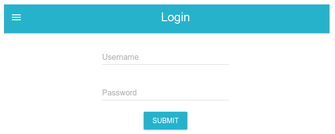

# Frontend stack

## How to use

Download the example [or clone the repo](https://github.com/mui-org/material-ui):

```sh
git clone https://github.com/vercel/next.js/issues/1791
cd gannett-frontend-assessment
```

Install it and run:

```sh
npm install
npm run dev
```

## What is being requested

1) Create a page accessible from the `/login` path.
2) Use the `LoginForm` component to display a login form using [material-ui](https://material-ui.com/) components. This could look something like that: 
3) The `LoginForm` should contains a submit button that once clicked display the username and password that have been entered by the user.
4) Use the `__test__/LoginForm` to ensure that the submit trigger the appropriate action.


## Considerations
You may restructure the code as you see fit (while respecting the provided rules), creating new files and directories as needed. 
The solution to the assignment have to be sent through a github PR.
